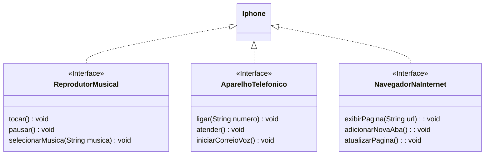

```mermaid
classDiagram
    class ReprodutorMusical {
        <<Interface>>
        tocar() void
        pausar() void
        selecionarMusica(String musica) void
    }
    class AparelhoTelefonico {
        <<Interface>>
        ligar(String numero) void
        atender() void
        iniciarCorreioVoz() void
    }
    class NavegadorNaInternet {
        <<Interface>>
        exibirPagina(String url): void
        adicionarNovaAba(): void
        atualizarPagina(): void   
    }
    

    Iphone <|.. ReprodutorMusical
    Iphone <|.. AparelhoTelefonico
    Iphone <|.. NavegadorNaInternet


```